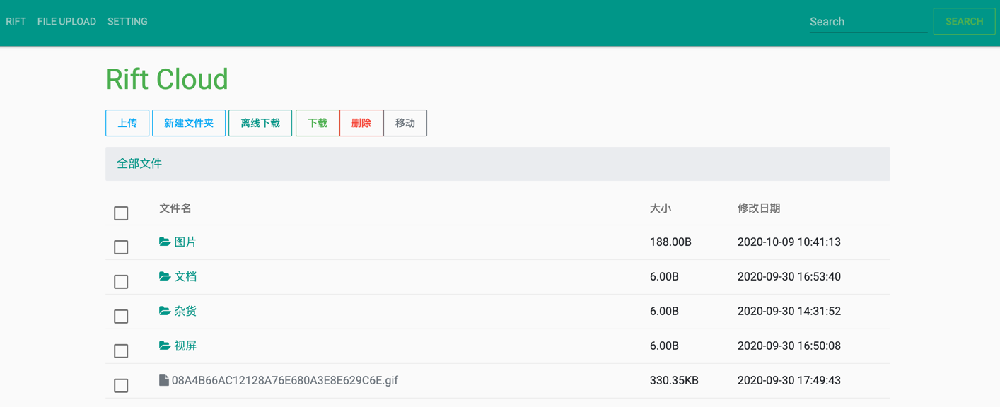
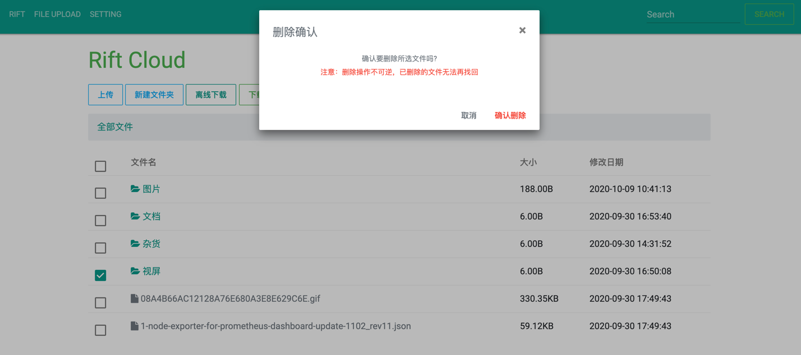
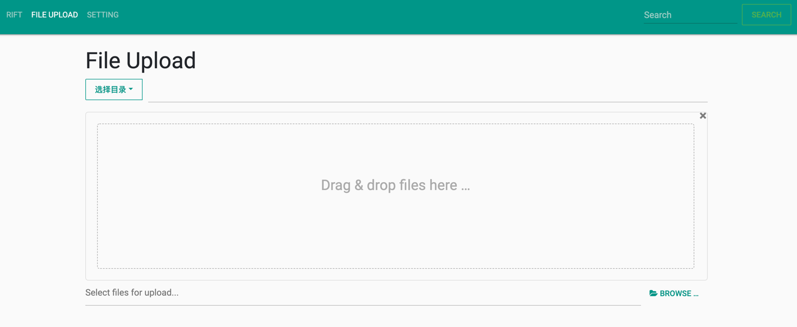

# Rift

## 简介
Rift是一个类似于百度网盘的私人云盘工具，如果你想拥有一个私人云盘工具，但是受不了百度网盘的下载速度，或则你想拥有安全不受监管的云文件存储，亦或是你想拥有一个私人图床工具，Rift也许会很适合你，前提是你有一台云服务器

Rift分为前端和后端，前端是一个谷歌浏览器扩展插件，使用比较简洁，后端是通过go实现的一个云文件服务程序，要想使用Rift，你需要部署后端程序，并导入chrome插件

## 快速开始
1. 从源代码编译:go支持交叉编译，你可以在项目目录执行如下命令进行编译，当然你也可以点击[这里]()下载编译好的文件
    ```go
    CGO_ENABLED=0 GOOS=linux GOARCH=amd64 go build -a -ldflags '-extldflags "-static"' -o rift .
    ```
2. 将编译好的rift二进制文件拷贝到你的云主机上，并执行`nohup ./rift &`命令启动后端程序，启动之后会在conf目录下生成app.toml配置文件，将里面的domain和token项拷贝出来，待会有用。（当然，作为测试，你也可以在本地运行rift）如果启动不成功很可能是端口冲突了，rift默认使用8088端口，请确保该端口没有被使用

3. 打开谷歌浏览器的扩展管理（或直接输入 chrome://extensions/），打开开发者模式，然后点击`加载已解压的扩展程序`选择`rift/front/rift`目录(或直接将`rift.crx`文件拖入页面中)即可加载该扩展程序

4. 点击已加载的rift扩展程序，首次进入会要求输入domain和token（username和password可以不用填写），输入第二步中获取的domain和token即可

## 预览




## LICENSE
Rift is Open Source software released under the [MIT License](LICENSE)
